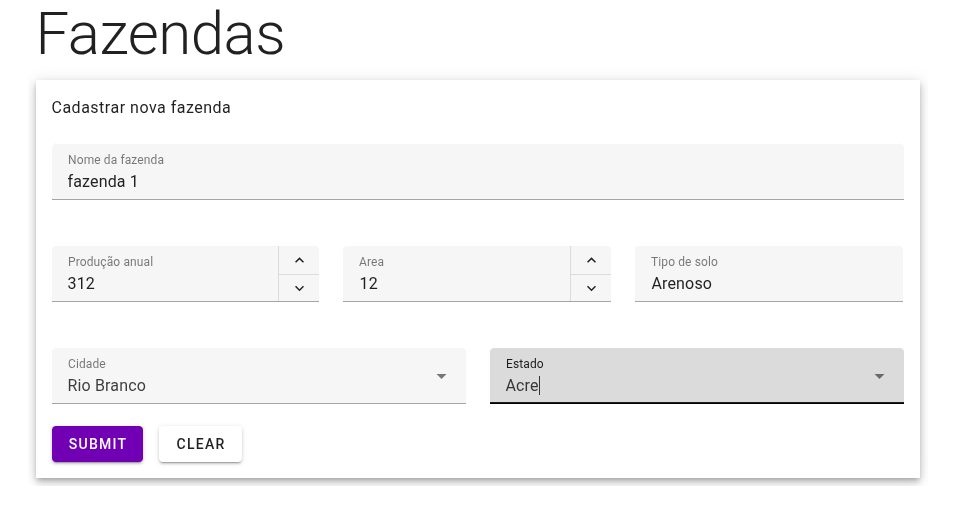
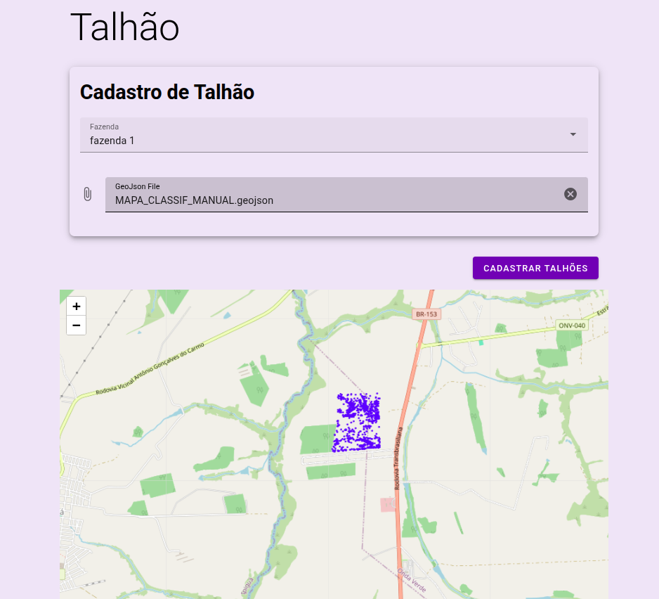
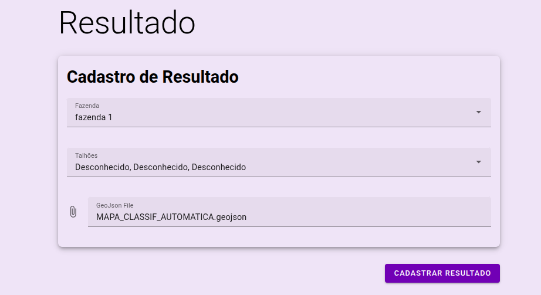
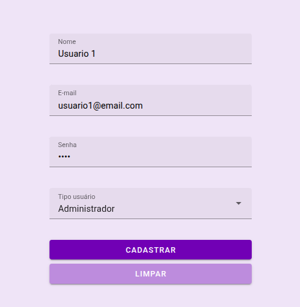
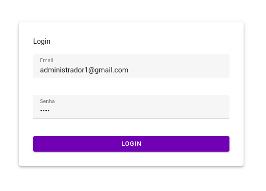
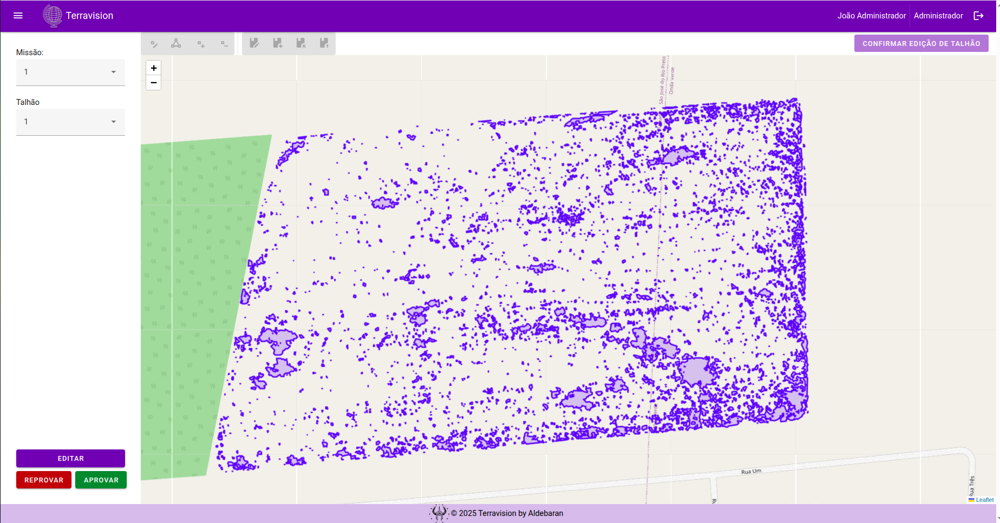

# Manual do Usuário - TerraVision

## Introdução

O *TerraVision* é uma ferramenta desenvolvida para visualização, edição geoespacial e a análise de dados em tempo real contribui para uma melhoria nos resultados produzidos pelos modelos automáticos. Ele permite a criação de diversos usuários com diferentes tipo: administrador, consultor e analista. Além disso, é possível acessar dashboards com base nas análises de dados geoespaciais.

---

## Funcionalidades Disponíveis

### 1. Cadastro de Fazenda

O sistema permite o cadastro de fazendas que possuem metadados referentes ao desempenho da fazenda. Ao cadastrar uma fazenda, o usuário pode:

- Definir o *nome da fazenda*.
- Definir o *cultura da fazenda*.
- Definir sua *produtividade anual*
- Definir sua *área*
- Definir o *tipo de solo*
- *Cidade* a qual reside
- *Estado* o qual pertence

### 2. Cadastro de Talhões

Além das fazendas, o sistema permite cadastrar talhões associados a fazenda O usuário pode:

- Definir qual fazenda o talhão será associado.
- Definir o *nome do talhão*.
- Definir o *cultura do talhão*.
- Definir sua *área*
- Definir o *tipo de solo*
- Fazer upload do arquivo GeoJson que tem a *geometria* do talhão

### 3. Cadastro de Resultados

Pode-se também cadastrar novos resultados da IA, para o analista realizar o QA., é possível:
- Definir o *título do resultado*.
- Associar o resultado a um talhão
- Associar o resultado a uma fazenda
- Geometria GeoJson do resultado do talhão

### 4. Cadastro de Usuários
Também há o cadastro de novos usuários e atribuir suas funções (administrador, consultor ou analista). é possível:
- Definir o *nome do usuário*.
- Definir o *email do usuário*.
- Definir a *senha do usuário*.
- Atribuir a *função do usuário*, se ele será um Administrador, Consultor ou Analista.

### 5. Tela de login

O *TerraVision* oferece uma tela de login onde é possível acessar seu respectivo perfil com as devidas atribuições para trabalho. A tela possui:

- Campo para preencher *email*.
- Campo para preencher *senha*.
- Botão de validação de credenciais.

### 6. Edição de geometria

O *TerraVision* um campo exclusivo para a edição das geometrias dos resultados de talhão, onde é possível criar, excluir e remodelar os campos existentes. A tela possui:

- Visualização *prévia do mapa* com os resultados.
- Botões com funcionalidades de permitir *criação, exclusão e edição de geometria*.
- Botão de *aprovação* de edição.
- Botão de *reprovação* de edição.

## Processos de Uso
## 1. **Cadastro de Fazenda**
1. Acesse a aba **Fazendas** no menu principal.
2. Clique em **Cadastrar nova Fazenda**.
3. Preencha os seguintes campos:
   - Nome da fazenda
   - Cultura da fazenda
   - Produtividade anual (em toneladas/hectare, por exemplo)
   - Área total da fazenda (em hectares)
   - Tipo de solo
   - Cidade
   - Estado
4. Clique em **Salvar** para concluir o cadastro.

---

## 2. **Cadastro de Talhões**
1. Acesse a aba **Talhões**.
2. Clique em **Cadastrar novo Talhão**.
3. Selecione a fazenda à qual o talhão pertence.
4. Preencha os seguintes campos:
   - Nome do talhão
   - Cultura do talhão
   - Área (em hectares)
   - Tipo de solo
5. Faça upload do arquivo **GeoJson** com a geometria do talhão.
6. Clique em **Salvar**.

---

## 3. **Cadastro de Resultados**
1. Vá até a aba **Resultados**.
2. Clique em **Cadastrar novo Resultado**.
3. Preencha os seguintes dados:
   - Título do resultado
   - Selecione a **fazenda** associada
   - Selecione o **talhão** associado
4. Faça upload do **arquivo GeoJson** com a geometria gerada pela IA.
5. Clique em **Salvar**.
---
## 4. **Cadastro de Usuários**
1. Acesse a aba **Usuários**.
2. Clique em **Cadastrar novo Usuário**.
3. Preencha os campos:
   - Nome do usuário
   - E-mail
   - Senha
4. Selecione a **função** do usuário: Administrador, Consultor ou Analista.
5. Clique em **Salvar**.
---
## 5. **Acesso à Tela de Login**
1. Na página inicial do *TerraVision*, acesse a **tela de login**.
2. Preencha os campos:
   - E-mail
   - Senha
3. Clique em **Entrar**.
4. Após validação, você será redirecionado para sua área de trabalho conforme a função atribuída (Administrador, Consultor ou Analista).
---
## 6. **Edição de Geometria dos Resultados**
1. Acesse a aba **Edição de Geometria**.
2. Selecione o **resultado do talhão** que deseja editar.
3. Visualize a geometria atual no **mapa interativo**.
4. Utilize as ferramentas disponíveis para:
   - Criar novas geometrias
   - Excluir geometrias existentes
   - Remodelar geometrias atuais
5. Após as edições, clique em:
   - **Aprovar** para confirmar as alterações, ou
   - **Reprovar** para descartar as alterações.
---

## Observações Finais

- O sistema permite a visualização, edição e exclusão de todas as entidades cadastradas (**Fazendas**, **Talhões**, **Resultados** e **Usuários**) diretamente pela interface, garantindo flexibilidade na gestão dos dados.
- Os arquivos **GeoJson** utilizados nos cadastros de talhões e resultados devem estar corretamente formatados para garantir a renderização adequada no mapa interativo.
- A edição de geometrias deve ser feita com cautela, pois qualquer alteração será refletida nas análises e visualizações de resultados. Utilize os botões de **aprovação** e **reprovação** com responsabilidade.
- O sistema considera perfis de acesso diferenciados (Administrador, Consultor e Analista), garantindo que cada usuário tenha permissões adequadas às suas atribuições.
- Certifique-se de que os dados inseridos nos cadastros sejam consistentes e atualizados, especialmente informações como produtividade, área e tipo de solo, pois impactam diretamente nas análises agronômicas.

